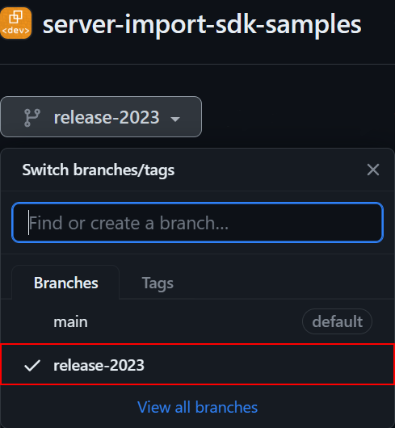

# Relativity Server Import Samples

This repository demonstrates how the Relativity Server Import SDK can be used to import the following:

* Native documents
* Images
* Objects
* Productions

All of the samples are based on [NUnit](https://nunit.org/), the [AAA](https://learn.microsoft.com/en-us/visualstudio/test/unit-test-basics?view=vs-2022#write-your-test) test structure pattern is followed, and app.config settings define test parameters including Relativity Urls and login credentials. Once these settings have been made, the tests are 100% responsible for all required setup and tear down procedures.

**Note:** the test project relies on [Relativity NuGet packages](https://www.nuget.org/packages?q=Relativity) to ensure Import API and all dependencies are deployed to the proper target directory.

This page contains the following information:

* [Prerequisites](#prerequisites)
* [Setup](#setup)
* [Import API class](#importapi-class)
  * [Authentication](#authentication)
  * [Jobs](#jobs)
  * [Data Source](#data-source)
  * [Events](#events)
  * [Execute](#execute)
* [Import Samples](#import-samples)
  * [Import documents](#import-documents)
  * [Import objects](#import-objects)
  * [Import images](#import-images)
  * [Import productions](#import-productions)

## Prerequisites

* Visual Studio 2022 and above
* A Server 2023 or above developer Dev VM
* Visual C++ 2015 x64 Runtime (Outside In and FreeImage)

**Note:** Visual Studio 2022 and above is required due to NuGet 6 and C# language feature usage. Relativity strongly recommends [using a developer Dev VM](https://platform.relativity.com/Server2022/Content/Get_started/Lesson_1_-_Set_up_your_developer_environment.htm) for the test environment.

## Setup
The steps below should only be required when the repository is being cloned for the first time.

<details><summary>View instructions</summary>

## Step 1 - Identify the branch
With each new Relativity Server annual release, a new branch is created to not only test and verify the Import SDK package but to ensure all package references are updated properly. As of this writing, the following three releases are available for consideration:



## Step 2 - Clone the repository
Use the command-line or Visual Studio to clone the repository and target a branch from the previous step.

```bash
git clone -b server-release-2023 https://github.com/relativitydev/server-import-sdk-samples.git
```

## Step 3 - Open the solution
Launch Visual Studio 2022 and open the Relativity.DataExchange.Samples.NUnit.sln solution file.

## Step 4 - Create the FunctionalTest.runsettings file
Open a PowerShell terminal and run the following script to autogenerate the .\src\FunctionalTest.runsettings file.

```powershell
.\New-TestSettings.ps1 -TestVMName <SPECIFY-DEVVM-NAME>
```

Once the file is created, click Test &rarr; Configure Run Settings &rarr; Select Solution Wide runsettings File, and select the .\src\FunctionalTest.runsettings file.

## Step 5 - Build Solution
Use Visual Studio to build the solution.

## Step 6 - Execute tests
At this point, the setup is complete and should now be able to run all of the tests. If the test explorer isn't visible, go to `Test->Windows->Test Explorer` and click the `Run All` hyper-link at the top. Regardless of which method is used to execute tests, the following actions occur:

* A new test workspace is created (normally 15-30 seconds) to ensure tests are isolated
* The tests are executed
* The test workspace is deleted
* The Test Explorer displays the results

If everything is working properly, the Test Explorer should look something like this:


**Note:** If the Test Explorer lists the tests but none of the tests run, **ensure the value is set to X64**. Although this setting is cached, Visual Studio is known to reset the value to X86.

</details>

## ImportAPI class
The `ImportAPI` class is a top-level class that includes functionality for importing documents, images, production sets, and Relativity Dynamic Objects (RDOs). It includes methods for performing these import jobs, as well as other methods for retrieving workspace, field, and other objects.

### Relativity Kepler REST Services
The Import SDK design uses the Relativity Kepler REST Services and proper URLs must be supplied when constructing the object.

* https://hostname.mycompany.corp (Relativity instance)
* https://hostname.mycompany.corp/relativitywebapi (Relativity web services)

### Authentication
When constructing the `ImportAPI` object, the API caller must first decide which authentication model is used in order to determine how the object is constructed.

**Note:** Authentication is immediately performed within the `ImportAPI` constructor and *will throw an exception* if a failure occurs. API callers should wrap this call with a try/catch block.

#### Relativity username and password authentication
The user must be a member of the System Administrators group in Relativity. These permissions are similar to those required to import a load file through the Relativity Desktop Client.

```csharp
ImportAPI importApi = new ImportAPI(relativityUserName, relativityPassword, relativityWebServiceUrl);
```

#### Bearer token authentication
Uses the current claims principal token to authenticate and should only be used by Relativity Service Account hosted processes.

```csharp
ImportAPI importApi = ImportAPI.CreateByRsaBearerToken(relativityWebServiceUrl);
```

**Note:** This is the preferred method for using Import API within an agent or custom page.

#### Windows authentication
The user is validated against the Relativity instance located at WebServiceURL.

```csharp
ImportAPI importApi = new ImportAPI(relativityWebServiceUrl);
```

### Jobs
Given the `ImportAPI` object, the API caller calls a method to create the appropriate job object. This is later used to configure and execute the import job.

```csharp
const int SomeObjectArtifactTypeId = 1111111;
const int ProductionSetArtifactId = 2222222;
kCura.Relativity.DataReaderClient.ImportBulkArtifactJob job = importApi.NewNativeDocumentImportJob();
kCura.Relativity.DataReaderClient.ImportBulkArtifactJob job = importApi.NewObjectImportJob(SomeObjectArtifactTypeId);
kCura.Relativity.DataReaderClient.ImageImportBulkArtifactJob job = importApi.NewImageImportJob();
kCura.Relativity.DataReaderClient.ImageImportBulkArtifactJob job = importApi.NewProductionImportJob(ProductionSetArtifactId);
```

#### ImportBulkArtifactJob Settings
When configuring either native document or object import jobs, the `Settings` property exposes a number of options to control import behavior.

<details><summary>View settings</summary>

| Setting                                     | Description                                                                                                                  |
|---------------------------------------------|------------------------------------------------------------------------------------------------------------------------------|
| ArtifactTypeId                              | The target object artifact type identifier.                                                                                  |
| Billable                                    | Indicates whether imported files are billable.                                                                               |
| BulkLoadFileFieldDelimiter                  | The field delimiter used when writing out the bulk load file.                                                                |
| CaseArtifactId                              | The target workspace artifact identifier.                                                                                    |
| CopyFilesToDocumentRepository               | Indicates whether to enable or disable copying files to the document repository.<ul><li>If True, the files are copied.</li><li>If False, files will be linked instead.</li></ul> |
| DisableControlNumberCompatibilityMode       | Indicates whether to enable or disable the use of `Control Number` to override `SelectedIdentifierField`.<ul><li>If True, tries to use `Control Number` for the `SelectedIdentifierField` and ignores `SelectedIdentifierField`.</li><li>If False and `SelectedIdentifierField` is not set, uses the default identifier field.</li></ul> |
| DisableExtractedTextEncodingCheck           | Indicates whether to enable or disable encoding checks for each file.<ul><li>If True, encoding checks are disabled.</li><li>If False, encoding checks are disabled.</li></ul> |
| DisableExtractedTextFileLocationValidation  | Indicates whether to enable or disable validation of the extracted text file location.<ul><li>If True, validation is disabled. If an extracted text file doesn't exist, the job fails.</li><li>If False, validation is enabled.</li></ul> |
| DisableNativeLocationValidation             | Indicates whether to enable or disable validation of the native file path.<ul><li>If True, validation is disabled.</li><li>If False, validation is enabled.</li></ul> |
| DisableNativeValidation                     | Indicates whether to enable or disable validation of the native file type for the current job.<ul><li>If True, validation is disabled.</li><li>If False, validation is enabled.</li></ul> |
| DisableUserSecurityCheck                    | Indicates whether to enable or disable user permission checks per document or object.<ul><li>If True, user permission checks are disabled.</li><li>If False, validation checks are enabled.</li></ul> |
| ExtractedTextEncoding                       | The extracted text file encoding.                                                                                            |
| ExtractedTextFieldContainsFilePath          | Indicates whether the extracted text field contains a path to the extracted text file or contains the actual extracted text.<ul><li>If True, the extracted text field contains a path to the extracted text file.</li><li>If False, the extracted text field contains the actual extracted text.</li></ul> |
| FileSizeColumn                              | The column that contains the `FileSize` on the `SourceData` property.                                                          |
| FileSizeMapped                              | Indicates whether to enable or disable skipping file size checks.<ul><li>If True, the file size is mapped and `OIFileIdColumnName` and `FileSizeColumn` must be mapped.</li><li>If False, the file size isn't mapped.</li></ul> |
| FolderPathSourceFieldName                   | The metadata field used to build the folder structure.<br/><br/>**Note:**  All folders are built under the Import Destination folder, indicated by the `DestinationFolderArtifactID` value. If a folder matching the entered string already exists, the documents will be added to it; otherwise, the folder(s) (including nested folders) will be created and the documents will be imported into the new folder(s). |
| IdentityFieldId                             | The key field that's set only on Overwrite mode.                                                                             |
| LoadImportedFullTextFromServer              | Indicates whether to enable or disable loading extracted text directly from its file path.<ul><li>If True, the extracted text field data is loaded directly from its file path. extracted text files must exactly match the encoding of the extracted text field. If extracted text is unicode enabled, the files need to be UTF-16 encoded, otherwise they need to be ANSI. This setting will only be used when `ExtractedTextFieldContainsFilePath` is also set to True.</li><li>If False, the extracted text field data is loaded from the bulk-load file.</li></ul> |
| MaximumErrorCount                           | The maximum number of errors displayed. This property is optional.                                                           |
| MoveDocumentsInAppendOverlayMode            | Indicates whether to enable or disable moving documents to a new folder for Append/Overlay mode.<ul><li>If True, the documents are moved to a new folder for Append/Overlay mode.</li><li>If False, the documents are not moved.</li></ul> |
| NativeFileCopyMode                          | The native file copy behavior.<ul><li>**DoNotImportNativeFiles:** documents are imported without their native files.</li><li>**CopyFiles:** native files are copied into the workspace.</li><li>**SetFileLinks:** Link to the native files but don't copy them.</li></ul> |
| NativeFilePathSourceFieldName               | The name of the field that contains the full path and filename for the native files.                                         |
| OIFileIdColumnName                          | The name of the field that contains the `OutsideInFileId` on the data source object.<br/><br/>**Note:** If `OIFileIdMapped` or `FileSizeMapped` is True, set this property to the value that indicates the field that. contains the `OutsideInFileId` value. |
| OIFileIdMapped                              | Indicates whether to enable or disable file identification.<ul><li>If True, the file identifier is mapped. Both `OIFileIdColumnName` and `OIFileTypeColumnName` must be set.</li><li>If False, the file identifier isn't mapped.</li></ul> |
| OIFileTypeColumnName                        | The name of the field that contains the Outside In file type on the data source.<br/><br/>**Note:**  If `OIFileIdMapped` is True, this field must be set. |                                                               |
| OverwriteMode                               | The import overwrite behavior.<ul><li>**Append:** Import all files even if that causes duplication. This is faster than Append/Overlay mode.</li><li>**Overlay:** Update all files if new versions are made available by the import.</li><li>**AppendOverlay:** Import all files. Those that are duplicates will be updated to the new version of the file.</li></ul> |
| SelectedIdentifierFieldName                 | The name of the field used as an identifier.<br/><br/>**Note:**  If this identifier cannot be resolved, the control number will be used in its place. |
| StartRecordNumber                           | The record number from which to start the import.                                                                           |

</details>

#### ImageImportBulkArtifactJob Settings
When configuring either image or production import jobs, the `Settings` property exposes a number of options to control import behavior.

<details><summary>View settings</summary>

| Setting                                     | Description                                                                                                                  |
|---------------------------------------------|------------------------------------------------------------------------------------------------------------------------------|
| ArtifactTypeId                              | The target object artifact type identifier.                                                                                  |
| AutoNumberImages                            | Indicates whether to enable or disable appending a page number to a page-level identifier.<ul><li>If True, a new incremental number (such as 01, 02) is added to the page-level identifier to create a unique page number.</li><li>If False, the page number isn't appended.</li></ul> |
| BatesNumberField                            | The name of the field that defines the unique identifier.<br/><br/>**Note:** This unique identifier may be called `Bates Number` or `Control Number` in a database. |
| Billable                                    | Indicates whether imported files are billable.                                                                               |
| CaseArtifactId                              | The target workspace artifact identifier.                                                                                    |
| CopyFilesToDocumentRepository               | Indicates whether to enable or disable copying files to the document repository.<ul><li>If True, the files are copied.</li><li>If False, files will be linked instead.</li></ul> |
| DisableExtractedTextEncodingCheck           | Indicates whether to enable or disable encoding checks for each file.<ul><li>If True, encoding checks are disabled.</li><li>If False, encoding checks are disabled.</li></ul> |
| DisableImageLocationValidation              | Indicates whether to enable or disable image location validation.<ul><li>If True, validation checks are disabled.</li><li>If False, validation checks are enabled.</li></ul> |
| DisableImageTypeValidation                  | Indicates whether to enable or disable image type validation.<ul><li>If True, validation checks are disabled.</li><li>If False, validation checks are enabled.</li></ul> |
| DisableUserSecurityCheck                    | Indicates whether to enable or disable user permission checks per document or object.<ul><li>If True, user permission checks are disabled.</li><li>If False, validation checks are enabled.</li></ul> |
| DocumentIdentifierField                     | The name of the field that corresponds to the `DocumentIdentifier` field.                                                     |
| ExtractedTextEncoding                       | The extracted text file encoding.                                                                                            |
| ExtractedTextFieldContainsFilePath          | Indicates whether the extracted text field contains a path to the extracted text file or contains the actual extracted text.<ul><li>If True, the extracted text field contains a path to the extracted text file.</li><li>If False, the extracted text field contains the actual extracted text.</li></ul> |
| FileLocationField                           | The name of the field that corresponds with the `FileLocation` field.                                                        |
| FolderPathSourceFieldName                   | The metadata field used to build the folder structure.<br/><br/>**Note:**  All folders are built under the Import Destination folder, indicated by the `DestinationFolderArtifactID` value. If a folder matching the entered string already exists, the documents will be added to it; otherwise, the folder(s) (including nested folders) will be created and the documents will be imported into the new folder(s). |
| IdentityFieldId                             | The key field that's set only on `Overwrite` mode.                                                                             |
| ImageFilePathSourceFieldName                | The name of the field that contains the full path to the image file.                                                         |
| LoadImportedFullTextFromServer              | Indicates whether to enable or disable loading extracted text directly from its file path.<ul><li>If True, the extracted text field data is loaded directly from its file path. extracted text files must exactly match the encoding of the extracted text field. If extracted text is unicode enabled, the files need to be UTF-16 encoded, otherwise they need to be ANSI. This setting will only be used when `ExtractedTextFieldContainsFilePath` is also set to True.</li><li>If False, the extracted text field data is loaded from the bulk-load file.</li></ul> |
| MaximumErrorCount                           | The maximum number of errors displayed. This property is optional.                                                           |
| MoveDocumentsInAppendOverlayMode            | Indicates whether to enable or disable moving documents to a new folder for Append/Overlay mode.<ul><li>If True, the documents are moved to a new folder for Append/Overlay mode.</li><li>If False, the documents are not moved.</li></ul> |
| NativeFileCopyMode                          | The native file copy behavior.<ul><li>**DoNotImportNativeFiles:** documents are imported without their native files.</li><li>**CopyFiles:** native files are copied into the workspace.</li><li>**SetFileLinks:** Link to the native files but don't copy them.</li></ul> |
| OverlayBehavior                             | The method for overlay imports with multiple choice and multi-object fields.<ul><li>**UseRelativityDefaults:** each field will be imported based on its overlay behavior settings in Relativity.</li><li>**MergeAll:** new imported values will be added to all imported fields.</li><li>**ReplaceAll:** all the imported fields previous values will all be overwritten with the imported values.</li></ul> |
| OverwriteMode                               | The import overwrite behavior.<ul><li>**Append:** Import all files even if that causes duplication. This is faster than Append/Overlay mode.</li><li>**Overlay:** Update all files if new versions are made available by the import.</li><li>**AppendOverlay:** Import all files. Those that are duplicates will be updated to the new version of the file.</li></ul> |
| SelectedIdentifierFieldName                 | The name of the field used as an identifier.<br/><br/>**Note:**  If this identifier cannot be resolved, the control number will be used in its place. |
| StartRecordNumber                           | The record number from which to start the import.                                                                           |

</details>

### Data Source
Regardless of which job is created, the API caller uses standard [ADO.NET](https://docs.microsoft.com/en-us/dotnet/framework/data/adonet/ado-net-overview) constructs like  `System.Data.DataTable` to define or `System.Data.IDataReader` to read data sources.

```csharp
// Once the data source is defined, the DataColumn names are mapped via the job Settings object.
System.Data.DataTable dataSource = new System.Data.DataTable();
dataSource.Columns.AddRange(new[]
{
    new DataColumn("control number", typeof(string)),
    new DataColumn("file path", typeof(string))
});

dataSource.Rows.Add("REL-4444444", @"C:\temp\sample.pdf");
job.Settings.SelectedIdentifierFieldName = "control number";
job.SourceData.SourceData = dataSource.CreateDataReader();
```

### Events
The `ImportBulkArtifactJob` and `ImageImportBulkArtifactJob` objects expose a number of useful events to obtain document-level errors, completion, fatal exception, and progress details.

#### JobReport
This object is exposed by several events and provides useful job summary details.

| Property                      | Description                                                                                                          |
| ------------------------------| ---------------------------------------------------------------------------------------------------------------------|
| EndTime                       | The import end time.                                                                                                 |
| ErrorRowCount                 | The total number of non-fatal document-level errors that occurred.                                                   |
| ErrorRows                     | The collection of non-fatal document-level error objects that occurred.                                                     |
| FatalException                | The exception that resulted in a fatal job error.                                                                    |
| FieldMap                      | The collection of field map entries that map source fields to destination fields in the workspace.                   |
| FileBytes                     | The total number of transferred native file bytes.                                                                   |
| MetadataBytes                 | The total number of transferred metadata bytes.                                                                      |
| StartTime                     | The import start time.                                                                                               |
| TotalRows                     | The total number of processed rows. This value doesn't indicate the number of successful rows.                       |

#### OnComplete
This event is raised when an import job is finished. A `JobReport` object is passed with detailed information about the job. A completed job may have errors if the data wasn't imported properly.

```csharp
// This event provides the JobReport object.
job.OnComplete += report =>
{
   Console.WriteLine("The job has completed.");
};
```

#### OnError
This event is raised when an error occurs while importing a row of data.

```csharp
// This event provides an IDictionary object with well-known parameters.
job.OnError += row =>
{
    Console.WriteLine(row["Line Number"]);
    Console.WriteLine(row["Identifier"]);
    Console.WriteLine(row["Message"]);
};
```

**Note:** The MaximumErrorCount is a configurable setting available on all import jobs that determines the number of errors to return.

#### OnFatalException
This event is raised when an import job encounters a fatal exception caused by invalid import settings or other issues. The fatal exception can be retrieved by the passed `JobReport` object.

```csharp
// This event provides the JobReport object.
job.OnFatalException += report =>
{
    Console.WriteLine("The job experienced a fatal exception: " + report.FatalException);
};
```

#### OnMessage
This event is raised throughout the import job life cycle and is similar to the messages displayed in the Relativity Desktop Client.

```csharp
// This event provides the Status object.
job.OnMessage += status =>
{
    Console.WriteLine("Job message: " + status.Message);
};
```

#### OnProcessProgress
This event is raised at the same rate as the `OnMessage` event and provides detailed progress information about the import job.

```csharp
// This event provides the FullStatus object.
job.OnProcessProgress += status =>
{
    Console.WriteLine("Job start time: " + status.StartTime);
    Console.WriteLine("Job end time: " + status.EndTime);
    Console.WriteLine("Job process ID: " + status.ProcessID);
    Console.WriteLine("Job total records: " + status.TotalRecords);
    Console.WriteLine("Job total records processed: " + status.TotalRecordsProcessed);
    Console.WriteLine("Job total records processed with warnings: " + status.TotalRecordsProcessedWithWarnings);
    Console.WriteLine("Job total records processed with errors: " + status.TotalRecordsProcessedWithErrors);
    Console.WriteLine("Job total records: " + status.TotalRecordsDisplay);
    Console.WriteLine("Job total records processed: " + status.TotalRecordsProcessedDisplay);
    Console.WriteLine("Job status suffix: " + status.StatusSuffixEntries);
};
```

#### OnProgress
This event is raised for each row found in the data set.

```csharp
// This event provides the row number.
job.OnProgress += row =>
{
    Console.WriteLine("Job progress line number: " + row);
};
```

### Execute
Once the job has been fully configured, the API caller invokes the `Execute` method. Soon thereafter, events are raised and the method returns once the job either completes or a fatal exception occurs.

```csharp
// Wait for the job to complete.
job.Execute();
```

**Note:** Although fatal exceptions are normally caught and raised by the `OnFatalException` event, API callers should wrap this method call with a try/catch block.

## Import Samples
The section below outlines each of the import job test samples.

### Import documents
* The [DocImportTests](src/Relativity.Server.Import.SDK.Samples/Tests/DocImportTests.cs "DocImportTests")  imports sample documents.
* The [DocImportFolderTests](src/Relativity.Server.Import.SDK.Samples/Tests/DocImportFolderTests.cs "DocImportFolderTests") imports sample documents and also specifies folder paths. 
* The [DocNegativeImportTests](src/Relativity.Server.Import.SDK.Samples/Tests/DocNegativeImportTests.cs "DocNegativeImportTests") imports documents that expect job-level import failures.

### Import objects
* The [ObjectSimpleImportTests](src/Relativity.Server.Import.SDK.Samples/Tests/ObjectSimpleImportTests.cs "ObjectSimpleImportTests") imports a custom object with a single-object field.
* The [ObjectAdvancedImportTests](src/Relativity.Server.Import.SDK.Samples/Tests/ObjectAdvancedImportTests.cs "ObjectAdvancedImportTests") imports a custom object with a multi-object field.
* The [ObjectNegativeImportTests](src/Relativity.Server.Import.SDK.Samples/Tests/ObjectNegativeImportTests.cs "ObjectNegativeImportTests") imports single-object and multi-object fields that expect document-level and job-level import failures.

**Note:** The tests create custom RDO types during the test setup.

### Import images
* The [ImageImportTests](src/Relativity.Server.Import.SDK.Samples/Tests/ImageImportTests.cs "ImageImportTests") imports sample images.

### Import productions
* The [ProductionImportTests](src/Relativity.Server.Import.SDK.Samples/Tests/ProductionImportTests.cs "ProductionImportTests") imports sample documents, creates a production, and then validates the bates numbers.

**Note:** This test relies upon the [Productions NuGet package](https://www.nuget.org/packages/Relativity.Productions.Client/) to perform all required functionality.